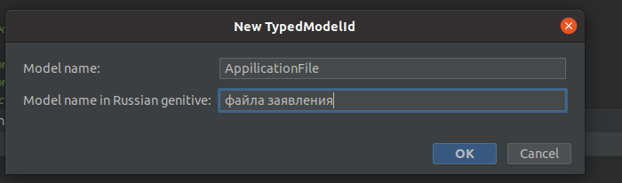

## Java Rule 10: Типизированные ID


Для извлечения типизированного ID из модели использовать метод `of()` одноимённого ID'шнику интерфейса. К DTO и кешу не относится.

Правильный вариант:
```
ClientUserId clientUserId = ClientUserId.of(clientUser);
```

Неправильный вариант:
```
ClientUserId clientUserId = ClientUserId.of(clientUser.getId())
```

Совсем неправильный вариант:
```
ClientUserId clientUserId = ClientUserId.of(clientUser.getClientUserId())
```
<br>
Если из модели нужно извлечь типизированный ID одноимённого поля, то у модели следует имплементировать интерфейс типизированного ID (такие интерфейсы называются ModelWith + ModelName + Id).

Правильный вариант:

```
UserId userId = UserId.of(clientUser);
```

Неправильный вариант:
```
UserId userId = UserId.of(clientUser.getUserId())
```

### Создание шаблонов файлов типизированных ID

#### Настройка шаблонов

1. Зайти в _Settings/Preferences_(Ctrl+Alt+S) | _Editor_ | _File and Code Templates_.
2. Создать шаблон с помощью кнопки "+"(Insert), ввести название шаблона(например, _TypedModelId_).
3. Ввести текст шаблона и ввести в поле FileName ```{$Model_name}Id```
```
#if (${PACKAGE_NAME} && ${PACKAGE_NAME} != "")package ${PACKAGE_NAME};#end
#set( $Id_class_name = "${Model_name}Id" )
import ru.ekd.commons.models.BaseModelId;

import java.util.UUID;

/**
 * <p>Типизированный ID ${Model_name_in_Russian_genitive}.</p>
 */
public final class ${Id_class_name} extends BaseModelId<UUID> {
    //region Ctor

    private ${Id_class_name}(UUID value) {

        super(value);
    }

    //endregion
    //region Static factories

    public static ${Id_class_name} empty() {

        return new ${Id_class_name}(null);
    }

    public static ${Id_class_name} of(ModelWith${Id_class_name} model) {

        return new ${Id_class_name}(model.get${Id_class_name}());
    }

    public static ${Id_class_name} of(UUID id) {

        return new ${Id_class_name}(id);
    }

    //endregion
}

```
4. Сохранить изменения и вернуться к общему списку шаблонов. 
5. Найти там только что добавленный шаблон, выбрать его и нажать кнопку "Create Child Template File". Ввести имя для 
дочернего файла шаблона ```ModelWith${Model_name}Id```. 
6. Ввести текст дочернего шаблона
```
#if (${PACKAGE_NAME} && ${PACKAGE_NAME} != "")package ${PACKAGE_NAME};#end
#set( $Id_class_name = "${Model_name}Id" )
import java.util.UUID;

/**
 * <p>Интерфейс модели, которая содержит ID ${Model_name_in_Russian_genitive}.</p>
 */
public interface ModelWith${Id_class_name} {
    //region Public

    /**
     * <p>Возвращает ID ${Model_name_in_Russian_genitive}.</p>
     *
     * @return ID ${Model_name_in_Russian_genitive}.
     */
    UUID get${Id_class_name}();

    //endregion
}

```
7. Сохранить изменения.

#### Использование шаблонов
1. Когда необходимо создать типизированный ID для модели, нажать правой кнопкой мыши в списке файлов проекта на 
директорию "ids" соответствующего сервера, в разделе _New_ найти созданный шаблон и выбрать его.

2. Ввести значение для переменной ```Model name```(Имя модели: _Application_, _Tenant_) и ```Model name in Russian genitive``` (Имя модели на русском языке в родительном падеже: ```заявления```, ```тенанта```).
3. Профит! Созданы 2 файла - класс типизированного ID и интерфейс.
