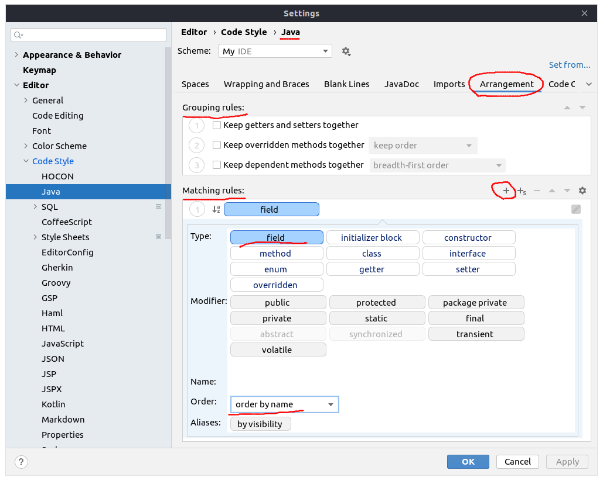

## Common Rule 2: Порядок полей класса

### Поля в классе группировать по модификаторам доступа, а внутри групп - в алфавитном порядке.
Исключения — классы моделей и DTO.

IDEA поддерживает автоматическую сортировку полей классов. Настройка для Java:

1. Перейти в настройки `File | Settings | Editor | Code Style | Java | Arrangement`.
2. Убрать все галочки из `Grouping rules`.
3. Удалить из `Matching rules` все правила, не касающиеся `field`.
   Оставшиеся правила будут группировать поля по модификаторам доступа.
4. Для каждого оставшегося правила задать `Order: order by name`. Теперь поля в группе будут отсортированы по алфавиту.
5. Также рекомендуется задать стандартные пустые строки после заголовка класса и вокруг полей: перейти в раздел `Blank lines` и в полях
   `After class header` и `Around field` вписать **1**.
6. Теперь, когда вам нужна пересортировка полей в классе, вы можете кликнуть `Code | Rearrange Code`, и поля в текущем 
   открытом файле будут отсортированы в соответствии с заданными правилами.





### При перечислении полей в классе, их порядок должен сохраняться и в конструкторе.

В случае наследования в перечислении в конструкторе первыми идут поля, которые объявлены в базовом/-ых классах.

IDEA поддерживает автоматическое добавление полей в конструктор для Java. После того как добавили поле класса, нажмите Alt + Enter на нём, и IDEA предложит добавить это поле как входной параметр конструктора. И если сделать эту операцию, то IDEA добавит параметр в конструктор согласно порядку полей при объявлении. 

Java:

```
public final class SomeService {

public class OtherService {

    private final Client client;

    private final SomeService someService;
}

public class SomeService extends OtherService {

    private final DateParser dateParser;

    private final SomeExtractor someExtractor;

    public SomeService(DateParser dateParser, SomeExtractor someExtractor) {
    

    /**
     * ...
     *
     * @param client ...
     * @param someService ...
     * @param dateParser ...
     * @param someExtractor ...
     */
    public SomeService(
        Client client,
        SomeService someService,
        DateParser dateParser,
        SomeExtractor someExtractor
    ) {
        super(client, someService);
        this.dateParser = dateParser;
        this.someExtractor = someExtractor;
    }
}
```

Typescript:

```
public class SomeService {

    private readonly DateParser _dateParser;

    private readonly SomeExtractor _someExtractor;

    /**
     * ...
     *
     * @param dateParser ...
     * @param someExtractor ...
     */
    constructor(DateParser dateParser, SomeExtractor someExtractor) {

        this._dateParser = dateParser;
        this._someExtractor = someExtractor;
    }
}
```


#### В билдере

При использовании .boulder() и .toBuilder() мы сохраняем порядок полей класса.

```
public class M {

    private final String firstName;

    private final String lastName;

    private final int age;

    private final String company;
}

public class SomeService {

    public M create(
        String firstName,
        String lastName,
        int age,
        String company
    ) {
        this.someRepository.insert(
            M.builder()
                .firstName(firstName)
                .lastName(lastName)
                .age(age)
                .company(company)
                .build()
        );
    }

    public M update(M model, String lastName, String company) {

        this.someRepository.update(
            model.tobuilder()
                .lastName(lastName)
                .company(company)
                .build()
        );
    }
}
```


#### В сигнатуре метода

В сигнатуре метода также сохраняется первоначальный порядок полей одного класса.

```
public class M {

    private final String firstName;

    private final String lastName;

    private final int age;

    private final String company;
}

public class SomeService {

    public M update(
        M model,
        String firstName,
        String lastName,
        int age,
        String company
    ) {
        this.someRepository.update(
            model.tobuilder()
                .firstName(firstName)
                .lastName(lastName)
                .age(age)
                .company(company)
                .build()
        );
    }
}
```
