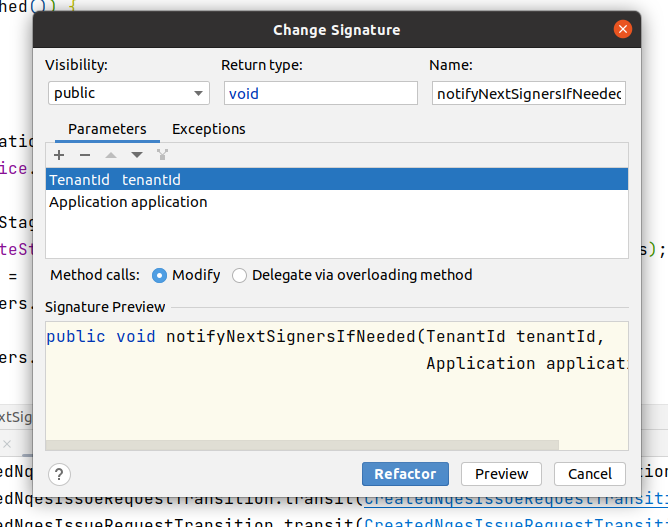

## Code style tools 2: Hotkeys Idea

**Основные горячие клавиши в Idea:**

Редактирование и рефакторинг:

- **Ctrl + Shift + V** - Расширенная вставка из буфера обмена (с историей)
- **Ctr + Alt + N** - Инлайнинг метода, переменной, аргумента или константы (вынесение логики метода в место вызова этого метода)
- Alt + insert - Генератор кода — сеттеров, геттеров, конструктора и тд
- **Ctr + alt + O** - Оптимизация импортов
- **Ctr + alt + L** - Приведение кода в соответствие code style
- **Ctr + alt + V** - Выделение переменной
- **Ctr + alt + M** - Выделение метода
- **Shift + F6** - Переименование переменной, класса и тд во всем коде
- **Ctr + F6** - Изменение сигнатуры метода во всем коде 
- **Ctr + shift + U (русская раскладка)**- Изменить регистр всех символов слова

Поиск:

- **Ctr + f** - Поиск в файле
- **Ctr + shift + f** - Поиск по всем файлам (переход — F4)
- **Ctr + shift + r** - Замена во всех файлах
- **shift + shift** - Быстрый поиск по всему проекту
- **ctrl + r + s** - Переход к местонахождению файла
- Ctr + F3 - Искать слово под курсором
- F3 / Shift + F3 - Искать вперед/назад
- **Ctr + G** - Переход к строке или строке:номеру_символа
- Ctr + N - Поиска класса по имени и переход к нему
- Ctr + Shift + N - Поиск файла по имени и переход к нему
- Shift + Alt + 7 - Найти все места, где используется метод / переменная
- Ctr + Alt + 7 - Как предыдущий пункт, только во всплывающем окне
- **Alt + J** - Выделение всех схожих вхождений
- F5 - Создать копию класса, файла или каталога

Git:

- Ctr + , + B - Открыть git-ветки
- Ctr + , + P - Push

Перемещение по файлу:

- **F2 / Shift + F2** - Переход к следующей / предыдущей ошибке
- **Ctr + shift + влево/вправо** - Выделение следующей за курсором структуры
- **Ctr + Del** - Удалить от текущей позиции до конца слова
- **Ctr + Backspace** - Удалить от текущей позиции до начала слова
- Shift + Del (Ctr + Y) - Удаление строки, отличие в том, где потом окажется курсор
- **Ctr + влево/вправо** - Перемещение между словами
- **Alt + вниз/вверх** - Перейти к следующему/предыдущему методу
- Ctr + Home/End - Переход в начало/конец файла
- Ctr + вверх/вниз - Прокрутка кода без изменения позиции курсора

Окна, вкладки:

- **Ctr + колесико** - zoom, но надо включить в настройке File → Settings → Editor и выбираем там галочку «Change font size (Zoom) with Ctr+Mouse Wheel»
- Alt + влево/вправо - Перемещение между вкладками
- Alt + циферка - Открытие/закрытие окон Project, Structure, Changes и тд

Подсказки и документация:

- **Ctr + E** - Список недавно открытых файлов с переходом к ним
- **Ctr + Shift + E** - Список недавно измененных файлов с переходом к ним
- **Ctr + W** - закрывает текущий файл
- **Ctr + K + W** - закрывает текущий файл
- Ctr + F12 - Список методов с переходом к их объявлению
- Ctr + H - Иерархия наследования текущего класса и переход по ней
- **Ctr + Alt + H** - Иерархия вызовов выбранного метода
- Ctr + Alt + S - настройки IDEA
- Ctr + Alt + Shit + S - настройки проекта
- Ctr + P - Подсказка по аргументам метода

Java live templates:

- inn - if (list != null) {...}
- ifn - if (list == null) {...}
- else-if - else if() {...}
- fori - for(int i = 0; i < ; i++) {...}
- iter/I - for (Object o : ) {...}
- itar - for(int i = 0; i < array.length; i++) { ...= array[i]; }
- itli - for (int i = 0; i < list.size(); i++) { Object o =  list.get(i); }
- souf - System.out.printf("");
- sout - System.out.println();
- thr - throw new
